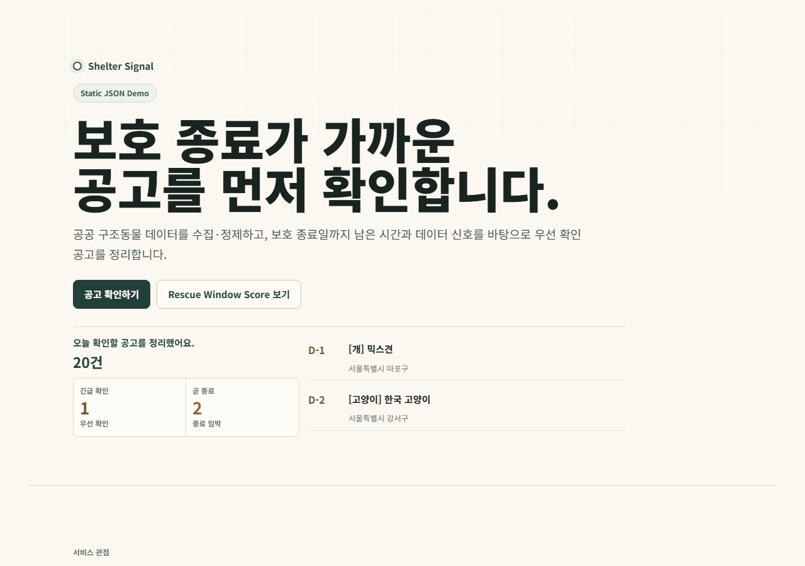
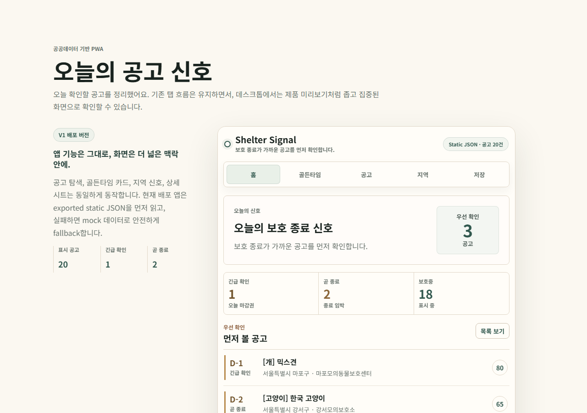
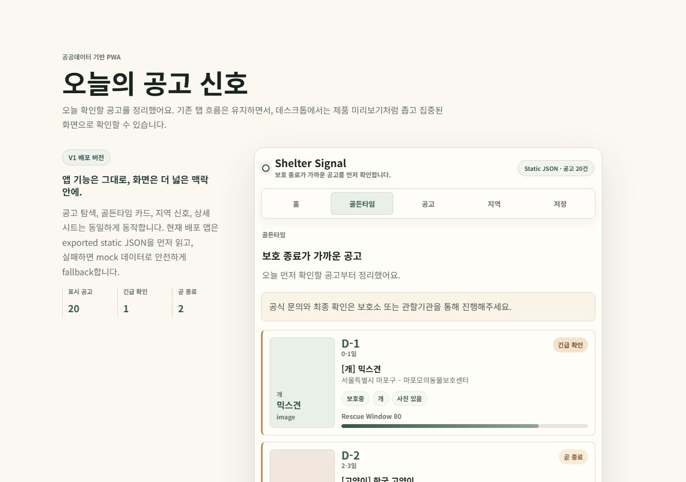
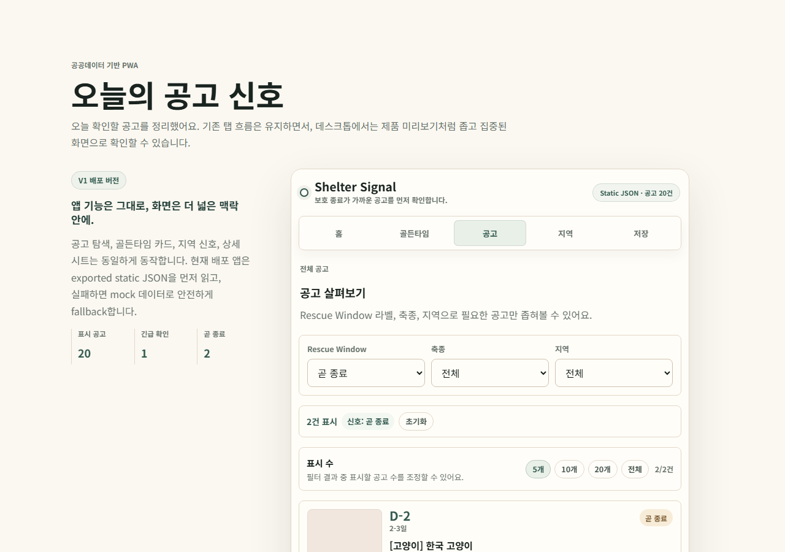
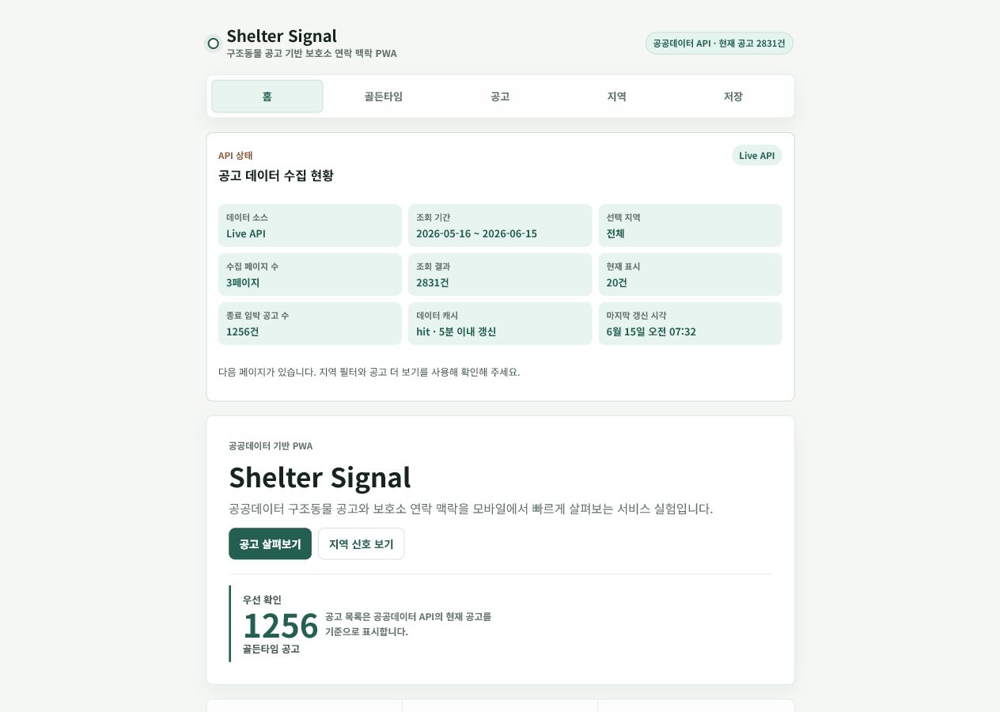

# Shelter Signal

[](https://github.com/dffxonnb-cyber/shelter-signal/actions/workflows/verify.yml)
[](https://shelter-signal-ebon.vercel.app/)
[](https://shelter-signal-ebon.vercel.app/api/notices?view=current&limit=20)
[](https://shelter-signal-ebon.vercel.app/)
[](docs/evidence/production-verification-2026-06-15.md)

**Shelter Signal은 불안정한 공공데이터 구조동물 공고 API를 사용자가 신뢰할 수 있는 마감 중심 탐색 흐름으로 감싼 모바일 PWA입니다.**

- Production: https://shelter-signal-ebon.vercel.app/
- Portfolio case study: [docs/portfolio-case-study.md](docs/portfolio-case-study.md)
- Verification guide: [VERIFY.md](VERIFY.md)
- Monthly snapshot workflow: [Monthly Notice Snapshot](.github/workflows/monthly-notice-snapshot.yml)
- Current Production evidence: [docs/evidence/production-verification-2026-06-15.md](docs/evidence/production-verification-2026-06-15.md)

Shelter Signal은 실제 보호소 운영 서비스가 아니라 public-data service 포트폴리오 프로젝트입니다. 사용자 계정, 저장 persistence, 실제 알림 전송, 운영 SLA는 포함하지 않습니다.

## 3-Minute Reviewer Path

| Step | Open | What to check |
| --- | --- | --- |
| 1 | [Production PWA](https://shelter-signal-ebon.vercel.app/) | Live API 상태, 모바일 우선 탐색 화면, fallback 경고 여부 |
| 2 | [Production evidence](docs/evidence/production-verification-2026-06-15.md) | live-first Production 상태와 public-safe evidence boundary |
| 3 | [VERIFY.md](VERIFY.md) | 수동 검증, CI 검증, secret-free test 범위 |
| 4 | [V2 dry-run evidence](docs/evidence/v2-dry-run-2026-06-19.md) | 실제 발송이 아닌 alert candidate와 digest 생성 dry-run 흔적 |
| 5 | [Portfolio case study](docs/portfolio-case-study.md) | 공공데이터 서비스로서의 문제 정의와 판단 흐름 |

## Reliability Snapshot

| Layer | What was designed |
| --- | --- |
| **Live source** | Vercel `/api/notices`가 data.go.kr 구조동물 공고 API를 server-side에서 먼저 조회 |
| **Freshness** | KST 기준 최근 30일 조회 후 `noticeEdt`가 만료되었거나 누락된 행을 current/urgent에서 제외 |
| **Views** | `current`, `urgent`, `protected`, `archive` view로 공고 상태를 분리 |
| **Pagination** | 기본 `limit=20`, 최대 `100`, `page` 기반 pagination과 `공고 더 보기` |
| **Cache** | 정규화된 live dataset을 기본 300초 동안 server-side instance cache에 보관 |
| **Fallback** | live API 실패 또는 unusable response일 때만 PostgreSQL → static JSON → mock 순서로 사용 |
| **Observability** | `source`, cache metadata, pagination metadata, `fallbackReason`으로 신뢰 상태를 구분 |
| **Secret boundary** | service key와 `DATABASE_URL`은 server-side 환경 변수로만 사용하고 frontend에 노출하지 않음 |

## Current Production Architecture

```text
React PWA
  → Vercel /api/notices
    → short server-side normalized-data cache
      → data.go.kr rescued-animal notice API
    → KST freshness normalization
    → current / urgent / protected / archive separation
    → region / view filtering
    → page / limit response
```

`/api/notices`의 primary path는 live public API입니다. PostgreSQL/Neon은 primary production read path가 아니며, live API를 사용할 수 없을 때의 server-side fallback 후보와 로컬 SQL 모델링 기반으로만 유지됩니다.

브라우저는 공공데이터 API나 PostgreSQL에 직접 연결하지 않습니다. 공공데이터 service key와 `DATABASE_URL`은 Vercel serverless route만 읽으며 응답, 로그, frontend bundle에 포함하지 않습니다.

## Notice API Flow

Default upstream request:

```text
bgnde = today in Asia/Seoul minus 30 days
endde = today in Asia/Seoul
state = notice
pageNo = 1
numOfRows = 1000
_type = json
```

서버는 upstream `totalCount`를 기준으로 최대 10페이지를 수집한 뒤 응답을 정규화합니다. 단일 upstream page는 최대 1,000건이며, public API가 XML·plain-text 오류 또는 unusable response를 반환할 수 있어 response parsing과 fallback 경계를 분리했습니다.

Supported response-layer query parameters:

```text
view = current | urgent | protected | archive
region = 서울 | 서울특별시 | 경기 | 경기도 | ...
page = 1..N
limit = 20 by default, capped at 100
```

`view`, `region`, response `page`, `limit`는 정규화된 base dataset에 적용됩니다. 같은 KST date range 안에서 지역이나 페이지를 바꾸어도 base cache를 재사용할 수 있습니다.

Example:

```text
/api/notices?view=urgent&region=서울&limit=20
/api/notices?view=current&region=경기&page=2&limit=20
```

## Freshness And Views

`noticeEdt`를 공개 공고 종료일로 사용하고 KST 날짜 기준으로 `days_left`와 `deadline_status`를 계산합니다.

```text
D-Day | D-1 | D-2 | D-3 | active | expired
```

- `current`: 종료되지 않았고 `noticeEdt`가 유효한 공고
- `urgent`: `days_left`가 0~3인 공고, deadline 오름차순
- `protected`: current 중 process state가 보호 상태인 공고
- `archive`: 만료 기록을 명시적으로 요청한 경우에만 반환

만료 공고와 `noticeEdt` 누락·파싱 실패 행은 `current`와 `urgent`에 포함하지 않습니다. 유효한 live query 결과가 0건인 경우에도 `source: "api"`인 정상 empty state로 처리합니다.

## Region Filtering And Pagination

지역 필터는 server-side에서 적용합니다. 서울/서울특별시, 경기/경기도 같은 대표 약칭과 행정명을 정규화하며, `orgNm`의 선두 행정구역을 우선 사용한 뒤 필요한 경우에만 `happenPlace`, `careAddr`, `careNm`을 확인합니다.

Pagination metadata:

```text
limit
page
returnedCount
totalFilteredCount
hasMore
nextPage
```

UI의 지역 변경은 server-filtered 첫 페이지를 요청하고, `공고 더 보기`는 `nextPage`를 요청합니다. 대량 live 결과를 한 번에 브라우저에 렌더링하지 않습니다.

## Cache, Fallback, And Observability

정규화된 live dataset은 server-side memory에 기본 300초 동안 캐시됩니다. `NOTICES_CACHE_TTL_SECONDS=0`이면 cache를 비활성화하며 최대 TTL은 600초입니다. 동시에 들어온 동일 base request는 가능한 경우 하나의 in-flight upstream fetch를 공유합니다.

주요 안전 metadata:

```text
source
fetchedAt
dateRange
pagesFetched
upstreamTotalCount
itemCount
filteredCount
normalizedItemCount
returnedCount
totalFilteredCount
hasMore
nextPage
cacheStatus
cacheGeneratedAt
cacheAgeSeconds
cacheScope
upstreamFetchDurationMs
upstreamFetchCount
inFlightMerged
fallbackReason
```

- Cache hit와 허용된 stale-live 응답은 usable live data에서 나온 것이므로 `source: "api"`를 유지합니다.
- TTL 만료 직후 refresh가 실패하면 이전 live dataset을 최대 15분 동안 stale-live로 사용할 수 있습니다.
- Live API 실패 또는 unusable response이고 사용할 수 있는 live cache도 없을 때만 fallback을 사용합니다.
- PostgreSQL, static JSON, mock fallback은 모두 `source: "fallback"`과 경고를 표시합니다.
- Empty live result는 fallback 사유가 아닙니다.

Safe structured logs에는 cache 상태, timing, count, view, page, limit만 기록합니다. service key, secret 환경 변수, secret이 포함된 full upstream URL은 기록하지 않습니다.

Vercel serverless memory cache는 instance-local이며 cold start, deployment, 다른 function instance 사이에서 공유를 보장하지 않습니다.

## Shelter Contact Context

`/api/shelters`는 server-side에서 구조동물 공고 API를 조회하고 `careNm`, `careTel`, `careAddr`, `orgNm`을 정규화해 연락 맥락을 제공합니다.

이 목록은 별도의 완전한 공식 보호소 디렉터리가 아니라 **구조동물 공고에서 파생한 연락 정보**입니다. 홈페이지, 운영 시간, 좌표, 시설 상세정보가 있다고 가정하지 않습니다.

## Fallback Warning

Fallback 데이터가 표시될 때만 UI에 다음 경고가 나타납니다.

> 공공데이터 API 응답이 불안정하여 샘플 데이터를 표시 중입니다. 실시간 공고가 아닐 수 있습니다.

Vite-only `npm run dev`는 Vercel serverless API가 함께 실행되지 않으면 static/mock fallback을 표시할 수 있습니다. 로컬에서 API route까지 확인하려면 별도 terminal에서 `npm run dev:api`를 실행하거나 Vercel proxy 환경을 구성합니다.

## Production Verification

Production smoke test는 live API 운영 상태와 UI 경계를 빠르게 확인하기 위한 절차입니다. 전체 upstream dataset의 완전성이나 공공기관 갱신 정확도를 증명하는 검증은 아닙니다.

1. https://shelter-signal-ebon.vercel.app/ 에서 데이터 상태 패널이 `Live API`인지 확인합니다.
2. fallback 경고가 표시되지 않는지 확인합니다.
3. 지역 선택과 `공고 더 보기`가 다음 server page를 요청하는지 확인합니다.
4. 아래 API를 호출합니다.

```text
https://shelter-signal-ebon.vercel.app/api/notices?view=current&region=서울&limit=20
```

5. 응답 `meta`에서 다음을 확인합니다.

```text
source = api
cacheStatus = hit | miss
dateRange = KST rolling window
itemCount or normalizedItemCount = collected normalized rows
returnedCount <= requested limit
hasMore / nextPage = pagination state
fallbackReason = absent for live/cache response
```

더 자세한 수동·CI 검증 범위는 [VERIFY.md](VERIFY.md)를 참조합니다.

## Archived Production Evidence

2026-06-15 KST 기준 live-first Production 상태를 public-safe evidence로 보관했습니다.

- [Evidence index](docs/evidence/README.md)
- [Production verification summary](docs/evidence/production-verification-2026-06-15.md)
- [Safe API metadata snapshot](docs/evidence/production-api-metadata-2026-06-15.json)
- [GitHub Actions Verify PASS snapshot](docs/evidence/github-actions-verify-2026-06-15.json)
- [Live-first Production UI screenshot](docs/screenshots/10-live-first-production-ui-2026-06-15.png)

이 evidence는 UI와 `/api/notices`의 live operating status, freshness 누수 검사, secret-free CI 통과를 확인합니다. 전체 upstream dataset의 완전성·정확성, 기관별 갱신 주기, 운영 SLA 또는 실제 구조 성과를 증명하지 않습니다. API evidence에는 notice rows가 없고, screenshot과 CI snapshot에도 service key, 환경 변수, full upstream URL을 포함하지 않습니다.

## Monthly Public-Data Snapshot Workflow

Shelter Signal now includes a manual GitHub Actions workflow for monthly public-data snapshot generation.

The workflow is designed in two modes:

- `dry_run=true`: checks the snapshot script path without calling the public API or writing snapshot files.
- `dry_run=false`: uses the server-side `DATA_GO_KR_SERVICE_KEY` secret to generate public-safe monthly snapshot artifacts.

Planned generated artifacts:

- `app/public/data/latest-notices.json`
- `app/public/data/latest-notices.meta.json`
- `app/public/data/monthly-notices/YYYY-MM.json`
- `app/public/data/monthly-notices/YYYY-MM.meta.json`

The monthly snapshot is not presented as real-time shelter operation data. It is portfolio evidence for public-data freshness context, fallback-boundary documentation, and workflow-monitored maintenance.


## V2 Dry-run Evidence

Shelter Signal V2 is a local preview and dry-run track for alert candidate and digest generation.

- [V2 dry-run evidence · 2026-06-19](docs/evidence/v2-dry-run-2026-06-19.md)

This does not claim Production notification delivery. Real email, SMS, push delivery, real recipients, subscription management, Production schedules, monitoring, and delivery SLA are out of scope.

## Screenshots

현재 tracked screenshot set의 `01`~`07`은 제품 흐름 설명용 캡처입니다.

| Landing | App Home |
| --- | --- |
|  |  |

| Golden Time | Notice Filters |
| --- | --- |
|  |  |

`08-operational-db-badge.png`와 `09-api-notices-operational-response.png`는 과거 PostgreSQL-primary 단계의 historical evidence입니다. 현재 Production 근거로 사용하지 않습니다. 자세한 분류는 [docs/screenshots/README.md](docs/screenshots/README.md)를 참조합니다.

현재 live-first Production evidence:



## Local Development And CI

The Vite application and serverless routes live under `/app`.

```powershell
cd app
npm ci
npm run lint
npm run typecheck
npm run build
```

CI는 secret과 외부 API 호출 없이 위 명령을 실행합니다. Production smoke test는 환경 변수와 외부 서비스 상태에 의존하므로 수동 검증으로 분리합니다.

Server-only environment variables:

```text
DATA_GO_KR_SERVICE_KEY=
DATABASE_URL=                 # optional fallback only
NOTICES_CACHE_TTL_SECONDS=300
```

`VITE_` prefix를 붙인 secret을 만들지 않으며 `.env`, `.vercel`, dumps, generated exports는 commit하지 않습니다.

## Optional Local Data Pipeline

로컬 PostgreSQL·SQL 모델은 fallback 검증, static export, alert candidate 실험을 위해 유지됩니다. 현재 Production primary read path는 아닙니다.

```powershell
docker compose up -d
python scripts/validate_pipeline.py
python scripts/export_app_data.py
```

## Historical / Archived Context

Shelter Signal은 과거에 Docker PostgreSQL → Neon PostgreSQL → `/api/notices`를 primary production read path로 사용하는 V1.5 계획을 검증했습니다. 이후 Production은 live-first public API path로 전환되었습니다.

- Current primary: public API → normalized cache → freshness/view/region/page response
- Current fallback: PostgreSQL → static JSON → mock
- Archived plan and evidence: [docs/neon-deployment.md](docs/neon-deployment.md)
- Local-only alert preview: [docs/v2-roadmap.md](docs/v2-roadmap.md)

Historical operational DB evidence는 구현 이력을 설명할 수 있지만 현재 Production 상태를 증명하지 않습니다.

## Limitations

- 공공데이터 API 권한, quota, 응답 지연, XML/plain-text 오류의 영향을 받습니다.
- 최대 upstream page cap 때문에 매우 큰 조회 범위는 완전히 수집되지 않을 수 있습니다.
- 기관별 공고와 process state 갱신 주기가 다를 수 있습니다.
- serverless instance cache는 cold start와 instance 간 공유를 보장하지 않습니다.
- notice-derived 보호소 연락 정보는 완전한 공식 보호소 디렉터리가 아닙니다.
- Rescue Window Score는 내부 탐색 신호이며 공식 위험 점수나 입양 예측이 아닙니다.
- 실제 사용자 계정, 저장, 알림 전송, 운영 모니터링과 SLA는 구현하지 않았습니다.

## Repository Map

```text
app/api/                 # Vercel serverless routes
app/src/                 # React PWA
app/public/data/         # static fallback exports
sql/                     # optional local PostgreSQL models and tests
scripts/                 # local validation and dry-run helpers
docs/                    # case study, archived plans, screenshots
.github/workflows/       # secret-free repository verification
```
