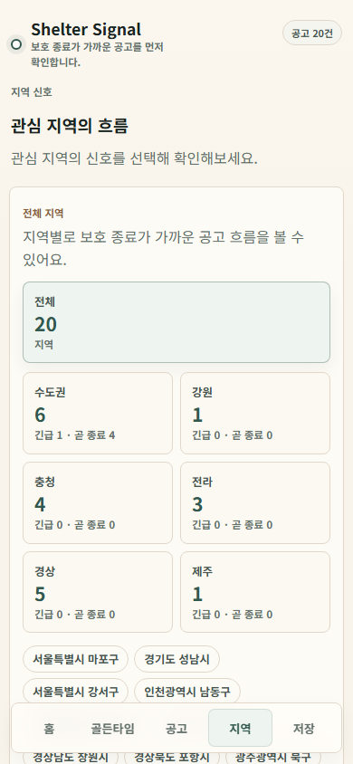
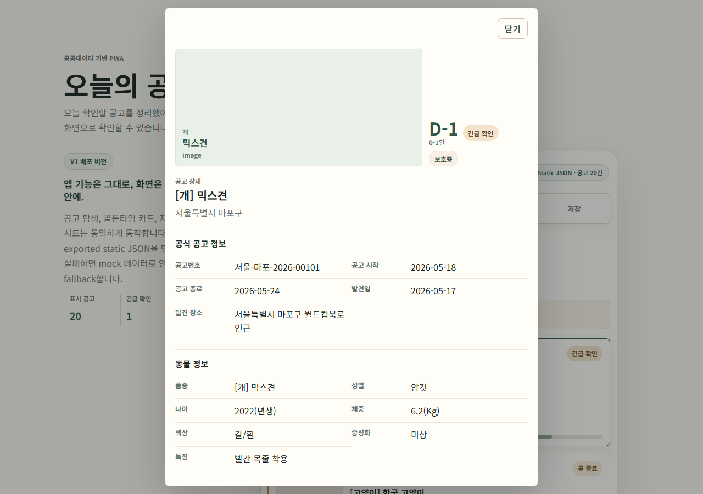
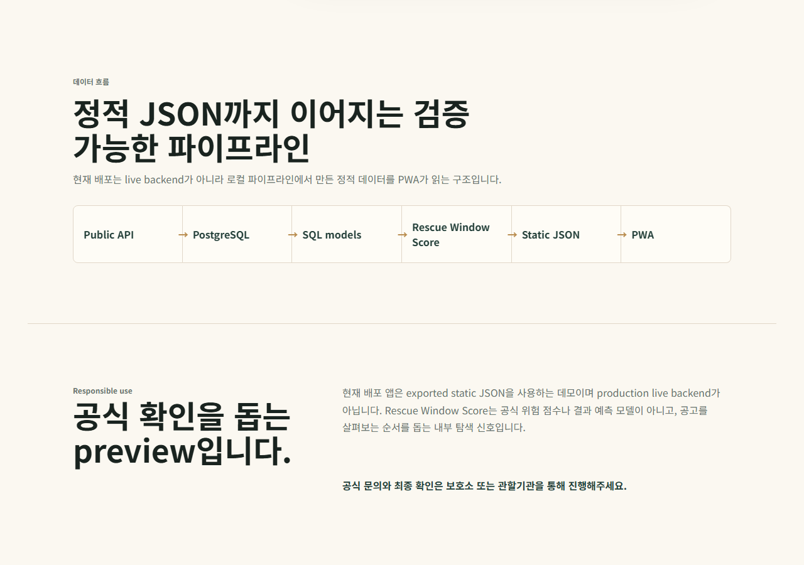
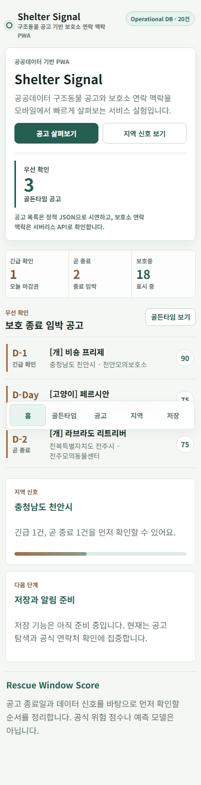
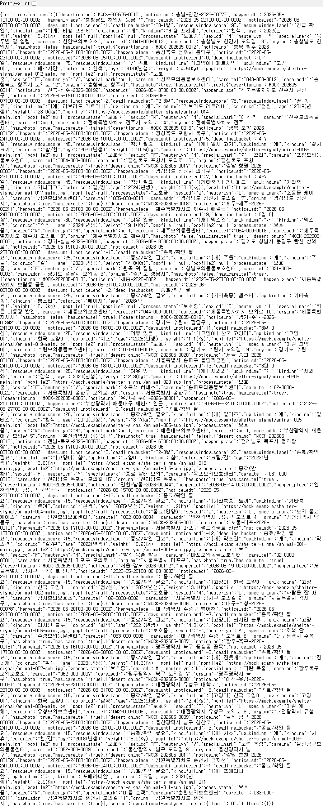

# Shelter Signal

**Shelter Signal은 공공데이터 구조동물 공고를 “먼저 확인할 공고”와 “보호소 연락 맥락”으로 재구성한 모바일 PWA 포트폴리오 프로젝트입니다.**

배포 링크: https://shelter-signal-ebon.vercel.app/

Shelter Signal V1.5는 production shelter service가 아니라 **portfolio-ready PWA prototype**입니다. 실제 사용자 계정, 저장 persistence, push/email/SMS 알림, production n8n 자동화는 포함하지 않습니다. 대신 공공데이터 기반 문제를 Docker local validation, Neon hosted PostgreSQL, Vercel API route, React PWA fallback 구조까지 연결한 데이터 제품형 MVP를 보여줍니다.

## Portfolio Snapshot

| 항목 | 내용 |
| --- | --- |
| 한 줄 정의 | 공공데이터 구조동물 공고 우선순위/보호소 연락 맥락 PWA |
| 핵심 사용자 질문 | 오늘 먼저 확인해야 할 공고는 무엇이고, 공식 문의에 필요한 보호소 정보는 어디에 있는가? |
| V1.5 구현 범위 | 모바일 PWA, Rescue Window Score, 공고 필터, 지역 신호, 상세 시트, Vercel `/api/notices`, Vercel `/api/shelters` |
| 데이터 전략 | `/api/notices`가 공공데이터 API를 먼저 사용하고, 실패 시 PostgreSQL → static JSON → mock 순서로 명시적 fallback |
| API 보안 | 브라우저는 `DATABASE_URL`이나 공공데이터 API key를 보지 않고, Vercel serverless routes만 서버 환경 변수를 읽음 |
| 포트폴리오 문서 | [docs/portfolio-case-study.md](docs/portfolio-case-study.md) |
| Neon 배포 노트 | [docs/neon-deployment.md](docs/neon-deployment.md) |

## Version Milestones

| Version | Definition |
| --- | --- |
| `v1.0.0` | Static JSON 기반 portfolio PWA |
| `v1.5.0` | Docker local DB validation + Neon operational read path + fallback architecture |
| `v2.0.0` 후보 | actual public-data ingestion into hosted DB, saved notices, alert subscription, n8n digest preview |

## What It Shows

- 구조동물 공고를 단순 최신순 목록이 아니라 `긴급 확인`, `곧 종료`, `확인 필요` 같은 우선순위 신호로 정리합니다.
- Rescue Window Score를 사용해 보호 종료일, 사진 여부, 연락처 여부 등 확인 신호를 설명 가능한 방식으로 UI에 연결합니다.
- 공고 목록, 지역 우선 필터, 점진적 더 보기, 지역 탐색, 상세 시트, 보호소 문의 안내까지 하나의 모바일 중심 PWA 흐름으로 구성합니다.
- 공공데이터 API key를 browser bundle에 넣지 않고, Vercel `/api/shelters` route가 서버에서 data.go.kr 구조동물 공고 API를 호출합니다.
- 보호소 연락 목록은 별도 공식 보호소 디렉터리가 아니라 공고 행의 `careNm`, `careTel`, `careAddr`, `orgNm`에서 만든 notice-derived summary임을 명확히 표시합니다.
- live API 응답이 없거나 실패하면 PostgreSQL, static JSON, 앱 내부 mock 데이터 순서로 명시적 fallback해 화면이 안전하게 동작하도록 설계했습니다.

## Data Flow

```text
Vercel /api/notices
→ public rescued-animal API
→ KST freshness filter and urgency calculation
→ Vite React PWA primary data
```

```text
/api/notices live request unavailable or unusable
→ PostgreSQL fallback
→ static JSON export fallback
→ mock fallback
```

```text
PWA region selector
→ /api/shelters
→ Vercel Serverless Function
→ data.go.kr rescued-animal notice API
→ notice-derived shelter/contact summaries
```

브라우저 앱은 PostgreSQL이나 data.go.kr API에 직접 연결하지 않습니다. 공고 목록은 `/api/notices`만 호출하고, 이 Vercel route가 서버 환경 변수 `DATA_GO_KR_SERVICE_KEY`로 공공데이터 API를 조회합니다. live 요청이 실패하거나 사용할 수 없는 응답이면 PostgreSQL을 시도하고, route 자체가 실패하면 앱은 `app/public/data/*.json` 정적 export와 `src/data/mockAnimals.ts` mock 데이터로 fallback합니다.

지역 보호소 연락 맥락은 프론트엔드가 `/api/shelters?sido=...&sigungu=...`만 호출합니다. 이 route는 서버 환경 변수 `DATA_GO_KR_SERVICE_KEY`를 읽어 공공데이터 API와 통신하고, 화면에는 공고에 포함된 보호소명, 전화번호, 주소, 관할기관 필드만 정규화해 전달합니다. 이 V1 live route에는 별도 데이터베이스 연결이 필요하지 않습니다.

## Screenshots

| Landing | App Home |
| --- | --- |
|  |  |

| Golden Time | Notice Filters |
| --- | --- |
|  |  |

| Region Explorer | Detail Sheet |
| --- | --- |
|  |  |

| Data Pipeline |
| --- |
|  |

| Operational DB Badge | Operational API Response |
| --- | --- |
|  |  |

## Features

- **Home signal**: 프로젝트 정체성, 정적 데이터 상태, 우선 확인 공고 요약
- **Golden Time list**: `긴급 확인`, `곧 종료` 공고 중심 리스트
- **Notice filters**: Rescue Window 라벨, 축종, 지역 필터
- **Notice display control**: 기본 20건과 점진적 `공고 더 보기`, 대량 결과 truncation 안내
- **Region explorer**: 시/도 → 시/군/구 드롭다운 기반 지역별 공고 신호 탐색
- **Shelter lookup**: 내부 API route를 통한 공고 기반 보호소 연락 맥락 조회와 안전한 실패 상태 표시
- **Detail sheet**: 공식 공고 정보, 동물 정보, 보호소 및 연락처 그룹화
- **Contact actions**: 전화번호 보기, 주소 확인, 공식 문의 안내
- **Saved placeholder**: 추후 저장 및 알림 기능을 위한 자리
- **PWA assets**: manifest, service worker, SVG icon, OG image metadata

## Tech Stack

- **Frontend**: Vite, React, TypeScript
- **Serverless API**: Vercel Functions under `/app/api`
- **PWA**: Web manifest, service worker, SVG app assets
- **Data**: Python, PostgreSQL, SQL
- **Pipeline**: Docker Compose, ingestion script, validation script
- **Modeling**: SQL migrations, SQL models, SQL tests
- **Export bridge**: Python static JSON export
- **Validation**: TypeScript build, Vite build, browser smoke test, `git diff --check`

## Current Status

This is a portfolio-ready PWA prototype, not a production shelter service.

Implemented:

- Mobile-first React PWA
- Live-first `/api/notices` loading from the public rescued-animal API
- Static JSON fallback loading from `app/public/data/*.json`
- Mock data fallback when exported JSON cannot load
- Rescue Window Score display and sorting
- Region-first notice filters and incremental load-more control
- Region signal explorer
- Internal `/api/shelters` route for notice-derived shelter/contact summaries when `DATA_GO_KR_SERVICE_KEY` is configured
- `/api/notices` freshness-first public API route connected as the frontend primary notice source
- Detail sheet with official notice and shelter contact fields
- Deployment-ready Vite app under `/app`

Not implemented:

- Production monitoring and SLA
- User accounts or authentication
- Persisted saved notices
- Push, email, or SMS notifications
- n8n automation in the deployed app
- Shelter homepage, operating-hours, or coordinate enrichment
- Production monitoring

## Live-first Production Read Path

현재 공고 화면은 Vercel의 server-only `/api/notices` route를 통해 공공데이터
구조동물 공고 API를 먼저 조회합니다. PostgreSQL은 live API가 실패했을 때만
사용되는 명시적 fallback이며, static export와 mock 데이터도 모두 fallback으로
표시됩니다. 브라우저에는 공공데이터 service key나 `DATABASE_URL`을 노출하지
않습니다.

2026-06-12 전환 이력:

- Preview deployment에서 freshness-first pipeline의 `source: "api"`를 확인했습니다.
- 당시 기존 Production은 오래된 `source: "operational-postgres"` 응답을 반환했습니다.
- Production을 live-first pipeline으로 재배포해 `/api/notices`의 `source: "api"`와
  UI의 `Live API` 상태를 확인했습니다.
- fallback 데이터는 경고와 `source: "fallback"`으로 명시하며 live 데이터처럼
  표시하지 않습니다.

Operational PostgreSQL과 SQL 모델은 alert 후보 생성과 분석 기반으로 유지합니다.
공고 UI의 primary read path는 더 이상 PostgreSQL이 아닙니다.

## Historical Operational DB Plan

이 절은 live-first route 이전의 DB 계획을 기록한 이력입니다. 현재 공고 UI의
primary source는 위의 `/api/notices` live public API path입니다.

다음 구조: 다음 backend 단계에서는 operational PostgreSQL을 serverless API route 뒤에 둡니다. 새 `/api/notices` route는 병렬로 추가된 server-only 경로이며, 배포 환경의 `DATABASE_URL`을 읽어 PostgreSQL을 조회하되 DB secret을 browser code에 노출하지 않습니다.

스키마 가정: `/api/notices`는 현재 `sql/models/001_animals_clean.sql`에 정의된 notice-level SQL view인 `mart.animals_clean`을 조회합니다. 선택 필드는 기존 `animals.json` export shape와 최대한 맞춰, operational path가 성숙하는 동안 정적 PWA bridge가 안정적으로 유지되도록 합니다.

이 기반이 필요한 이유:

- 최신 공고 조회
- 이후 실제 저장 공고 기능
- 마감일 기반 alert candidate
- 지역 signal refresh
- n8n automation foundation

현재 한계:

- auth 없음
- persisted saved notices 없음
- push/email/SMS notification 없음
- production monitoring 없음
- 당분간 static JSON이 primary frontend data source로 유지됨

## V2 Alert Pipeline Status

The `v2/n8n-email-alerts` branch is finalized as a local-development alert pipeline validation. It keeps V1 app behavior unchanged while proving the V2 notification foundation:

- PostgreSQL alert candidate foundation through `mart.alert_candidates`
- daily digest preview generation to JSON and HTML
- local n8n HTTP dry-run bridge with `POST /dry-run`
- `email_html` payload from `POST /dry-run?include_html=true`
- Mailpit local SMTP capture for email rendering checks
- one-command smoke test for dry-run, HTML export, SMTP send, and inbox verification

Recommended local verification:

```powershell
python scripts/run_v2_mailpit_email_capture_test.py
```

The script generates the digest HTML, sends it to Mailpit local SMTP at `localhost:1025`, checks the captured message through the Mailpit inbox at `http://localhost:8025`, and verifies the subject, sender, recipient, HTML body, and `Shelter Signal` content. No real external email is sent.

Manual n8n Send an Email setup is optional after this passes. Gmail, Google Cloud OAuth, Gmail SMTP, app passwords, production SMTP/email providers, real recipients, subscriptions, schedule activation, SMS, auth, and user accounts are intentionally deferred.

See:

- `docs/n8n/daily-email-digest-workflow.md`
- `docs/n8n/local-dry-run-setup.md`
- `docs/n8n/manual-test-email.workflow.json`

## API/Data Notes

### Freshness-first notice pipeline

`/api/notices` is now the primary freshness boundary for the notice UI. The Vercel
serverless route calls the public rescued-animal notice API with the server-only
`DATA_GO_KR_SERVICE_KEY`; the browser never receives that key.

Default upstream request parameters:

```text
bgnde = today in Asia/Seoul minus 30 days
endde = today in Asia/Seoul
state = notice
pageNo = 1
numOfRows = 1000
_type = json
```

`bgnde`, `endde`, `state`, `pageNo`, `numOfRows`, `bgupd`, and `enupd` can be
overridden through the internal `/api/notices` query string. `numOfRows` is capped
at `1000`. For the default `pageNo=1` request, the server follows the upstream
`totalCount` across up to 10 pages before sorting by deadline. The rolling
notice-start window reduces old upstream rows, while `state=notice` requests
currently announced notices. The response layer then applies server-side view,
region, and page filters instead of sending thousands of rows to the browser.

Supported response-layer query parameters:

```text
view = current | urgent | protected | archive
region = 서울 | 서울특별시 | 경기 | 경기도 | ...
page = 1..N
limit = 20 by default, capped at 100
```

Region matching normalizes common Korean short and administrative names. It uses
the leading administrative region in `orgNm` first, then checks `happenPlace`,
`careAddr`, and `careNm` only when a higher-priority field has no recognizable
region.
Pagination metadata includes `limit`, `page`, `returnedCount`,
`totalFilteredCount`, `hasMore`, and `nextPage`.

The route treats `noticeEdt` as the public notice end date. It recalculates
`days_left` against the current `Asia/Seoul` date and derives
`deadline_status` as one of:

```text
D-Day | D-1 | D-2 | D-3 | active | expired
```

Records with `noticeEdt` earlier than today, with a missing/unparseable
`noticeEdt`, or already carrying a `종료(...)` process state are excluded from
the default current-notice response. The response separates:

- `views.currentNotices`: non-expired notices used by the default UI
- `views.urgentNotices`: `days_left` from `0` through `3`, sorted by `noticeEdt` ascending
- `views.protectedAnimals`: current notices whose process state contains `보호`
- `views.expiredRecords`: archive rows only when explicitly requested with `includeExpired=true`

If the public API fails, `/api/notices` may use PostgreSQL as a server fallback.
If the route itself is unavailable, the frontend can use static export data and
then mock data. Every fallback path recomputes freshness and removes expired rows
from the default view. Mock dates are shifted relative to the current KST date so
the demo fallback does not silently decay into an all-expired dataset. Static
exports retain their real export dates and are filtered rather than relabeled.
Fallback responses/data carry:

```json
{
  "source": "fallback",
  "fetchedAt": "ISO-8601 timestamp",
  "dateRange": { "bgnde": "YYYY-MM-DD", "endde": "YYYY-MM-DD" },
  "warning": "공공데이터 API 응답이 불안정하여 샘플 데이터를 표시 중입니다. 실시간 공고가 아닐 수 있습니다."
}
```

The UI shows that warning whenever fallback data is active. A successful live API
response with zero current notices remains an empty live result and does not
silently switch to stale samples.

Safe `/api/notices` metadata includes `source`, `fetchedAt`, `dateRange`,
`requestState`, `itemCount`, `filteredCount`, `returnedCount`, `urgentCount`,
`pagesFetched`, `upstreamTotalCount`, `responseFormat`, `truncated`, `viewLimit`,
`totalFilteredCount`, `hasMore`, `nextPage`, and `fallbackReason` when
applicable. No service key or upstream URL containing the service key is returned
or logged.

Large public API results are not rendered at once. Region changes request a new
server-filtered first page, and `공고 더 보기` requests the next server page.
A valid region/view query with zero rows remains `source: "api"` with a normal
empty state. Fallback is reserved for upstream failure or an unusable response.

Known public API limitations:

- Public API permissions, service approval, quotas, and intermittent XML/error
  responses can make the live request unavailable.
- A single upstream request is capped at `1000` rows. The route follows up to 10
  pages, so unusually large date ranges can still be truncated.
- Page and region filters are applied after the server collects the available
  upstream window. An uncached filtered request can therefore still require
  several public API calls.
- `state=notice` and `noticeEdt` reflect public-source fields, but agencies can
  update notice/process state on their own schedule.
- Notice-derived shelter contact data is not a complete official shelter directory.
- Fallback data is useful for continuity and demonstration only; it is explicitly
  labeled and may not be real-time.

### Production live-first verification

On 2026-06-12, the freshness-first preview returned `source: "api"` while the
previous Production deployment still returned the legacy
`source: "operational-postgres"` response. Production was then redeployed with
the live-first route and verified against `/api/notices`. The Production UI shows
the compact API status panel and does not show the fallback warning while
`source: "api"` is active.

`npm run dev` starts Vite only. Vite-only development is expected to show labeled
static/mock fallback unless the serverless API or configured proxy is running.
Fallback data always carries `source: "fallback"` and the Korean warning; it is
never presented as live data.

Known live-verification risks remain public API quota/service approval, XML or
plain-text error responses, source-agency update-cycle differences, valid empty
live results, and the maximum upstream page cap.

The app currently uses public rescue animal notice fields that are already present in the notice data, including:

- `careNm`
- `careTel`
- `careAddr`
- `orgNm`

For live shelter lookup, Shelter Signal uses rescued-animal notice rows as the primary source:

- Public data source: 농림축산식품부 농림축산검역본부_국가동물보호정보시스템 구조동물 조회 서비스
- Notice endpoint used by the serverless route: `abandonmentPublicService_v2/abandonmentPublic_v2`
- Server-only environment variable: `DATA_GO_KR_SERVICE_KEY`
- Frontend entrypoint: `/api/shelters?sido=...&sigungu=...`

The service key must be configured in Vercel as `DATA_GO_KR_SERVICE_KEY`. Do not prefix it with `VITE_` or expose it in frontend code. Local secret files such as `.env` should remain uncommitted; `.env.example` only documents required keys.

Rows are deduplicated by `careNm + careTel + careAddr`. This avoids blocking the app on the separate shelter-center endpoint when that endpoint returns `403`.

The notice endpoint supports region code parameters such as `upr_cd` and `org_cd`. Shelter Signal keeps the UI labels in Korean, sends known stable codes when available, and lets the internal API route resolve missing codes through the public `sido_v2` and `sigungu_v2` helper endpoints before calling `abandonmentPublic_v2`.

The route returns JSON with a stable shape:

```json
{ "ok": true, "shelters": [], "source": "rescued-animal-notice-derived" }
```

If the key is missing, it returns:

```json
{ "ok": false, "code": "MISSING_SERVICE_KEY", "shelters": [] }
```

If the upstream public-data API fails, it returns:

```json
{
  "ok": false,
  "code": "UPSTREAM_ERROR",
  "upstreamStatus": 403,
  "message": "...",
  "upstreamError": {
    "rawSnippet": "..."
  },
  "shelters": []
}
```

The upstream diagnostic body is sanitized and never includes the raw service key.

The internal API route normalizes shelter responses into this frontend shape:

```ts
type Shelter = {
  id: string;
  name: string;
  address?: string;
  phone?: string;
  jurisdiction?: string;
  orgName?: string;
  source: "rescued-animal-notice-derived";
  raw?: unknown;
};
```

This notice-derived list is not a complete official shelter directory. It is shelter/contact context extracted from rescued-animal notices. Missing service keys, permission errors such as `403`, XML responses, empty lists, and network failures are handled as loading/error/empty states in the UI instead of crashing the app.

Do not assume support for shelter homepage URLs, operating hours, latitude/longitude coordinates, or detailed facility metadata until the actual API response shape and permissions are confirmed. Shelter Signal does not include real API keys, and `.env` files should remain local.

Rescue Window Score is an internal exploration signal. It is not an official risk score, adoption prediction, or legal/public-agency status.

## Local Development

### App

```powershell
cd app
npm install
npm run dev
npm run build
```

For local API-route testing through Vercel, configure local secrets outside git:

```text
DATABASE_URL=
DATA_GO_KR_SERVICE_KEY=
```

### Data Pipeline

```powershell
docker compose up -d
python scripts/validate_pipeline.py
python scripts/export_app_data.py
```

Generated app data is written to:

```text
app/public/data/animals.json
app/public/data/region_summary.json
app/public/data/rescue_window_summary.json
app/public/data/shelter_summary.json
app/public/data/kind_summary.json
```

## Vercel Deployment

The Vite app lives in `/app`, not the repository root.

```text
Root Directory: app
Install Command: npm install
Build Command: npm run build
Output Directory: dist
```

Production live notice loading through `/api/notices` and shelter lookup through
`/api/shelters` require the server-only `DATA_GO_KR_SERVICE_KEY` environment
variable in Vercel. `DATABASE_URL` is optional and is used only for the
PostgreSQL fallback path. Without a usable live API response, the main notice UI
renders a clearly labeled fallback warning. The deployed app does not require
auth, n8n, email, or SMS configuration.

After adding or changing Vercel environment variables, redeploy Production so the serverless function receives the new value.

### Troubleshooting `/api/shelters`

- `MISSING_SERVICE_KEY` means the Vercel Function cannot see `DATA_GO_KR_SERVICE_KEY`.
- Confirm the exact variable name: `DATA_GO_KR_SERVICE_KEY`.
- Confirm the variable is enabled for the Production environment.
- Redeploy Production after adding or changing the variable.
- Test the route directly: https://shelter-signal-ebon.vercel.app/api/shelters
- `UPSTREAM_ERROR` means the function has a key, but data.go.kr rejected or failed the rescued-animal notice request. Check service approval/permission for the notice endpoint before assuming live data is unavailable.
- `UPSTREAM_FORBIDDEN` means data.go.kr returned `403`. Common causes include service-specific approval not yet active, wrong endpoint or operation path, missing required parameters, Encoding/Decoding key mismatch, double-encoded `serviceKey`, or extra spaces/quotes in the environment value.
- If the separate shelter-center API is blocked, `/api/shelters` still uses the rescued-animal notice API and derives shelter summaries from `careNm`, `careTel`, `careAddr`, and `orgNm`.
- Use `python scripts/test_shelter_upstream_request.py` to compare the local rescued-animal notice upstream request shape without printing the key.

No database connection is required for this live shelter lookup route. The browser calls the internal Vercel API route, and only that serverless function calls data.go.kr.

### Troubleshooting `/api/notices`

- `source: "api"` means the public API request succeeded and returned usable
  notice rows.
- `source: "fallback"` includes a safe `fallbackReason`; check for a missing
  service key, upstream error/response shape, or request failure.
- A valid empty live result remains `source: "api"` and does not silently become
  sample data.
- The browser never receives `DATA_GO_KR_SERVICE_KEY` or `DATABASE_URL`; it only
  calls the internal `/api/notices` route.
- PostgreSQL, static JSON, and mock rows remain safe, explicitly labeled fallback
  paths.

## Portfolio Description

Shelter Signal은 공공데이터 구조동물 공고 API와 로컬 SQL 모델링을 기반으로, 보호 종료가 가까운 공고와 보호소 연락 맥락을 먼저 확인할 수 있게 정리한 모바일 PWA입니다. 공고 목록은 Vercel `/api/notices` route가 공공데이터 API를 서버에서 먼저 호출하고, 실패 시에만 PostgreSQL, 정적 JSON export, mock 데이터로 명시적 fallback합니다. 선택 지역의 보호소 연락 맥락은 별도 Vercel serverless API route가 공공데이터 API를 서버에서 호출해 notice-derived summary로 제공합니다.

Key highlights:

- 공공데이터 기반 구조동물 공고 탐색 경험 설계
- Rescue Window Score를 통한 우선 확인 흐름 제안
- PostgreSQL/SQL 모델링에서 PWA까지 이어지는 end-to-end 데이터 제품 MVP
- Vercel 내부 API route로 공공데이터 서비스 키를 숨기고 notice-derived 보호소 연락 맥락 제공
- operational DB, 정적 JSON fallback, live shelter API route의 역할을 분리한 portfolio demo
- operational DB가 없을 때도 static/mock fallback으로 깨지지 않는 공고 탐색 흐름

## Next Steps

- 배포 환경의 `DATABASE_URL` 설정과 `/api/notices` operational read 안정성 검증
- 실제 공공데이터 row를 Neon hosted DB에 적재하는 수집 경로 설계
- `v2/n8n-email-alerts` 브랜치를 `main`의 최신 V1.5 구조와 동기화
- `python scripts/run_daily_digest_dry_run.py` 재검증
- `mart.alert_candidates` 기반 digest preview 품질 확인
- 저장 기능과 실제 알림 흐름은 별도 단계에서 설계
